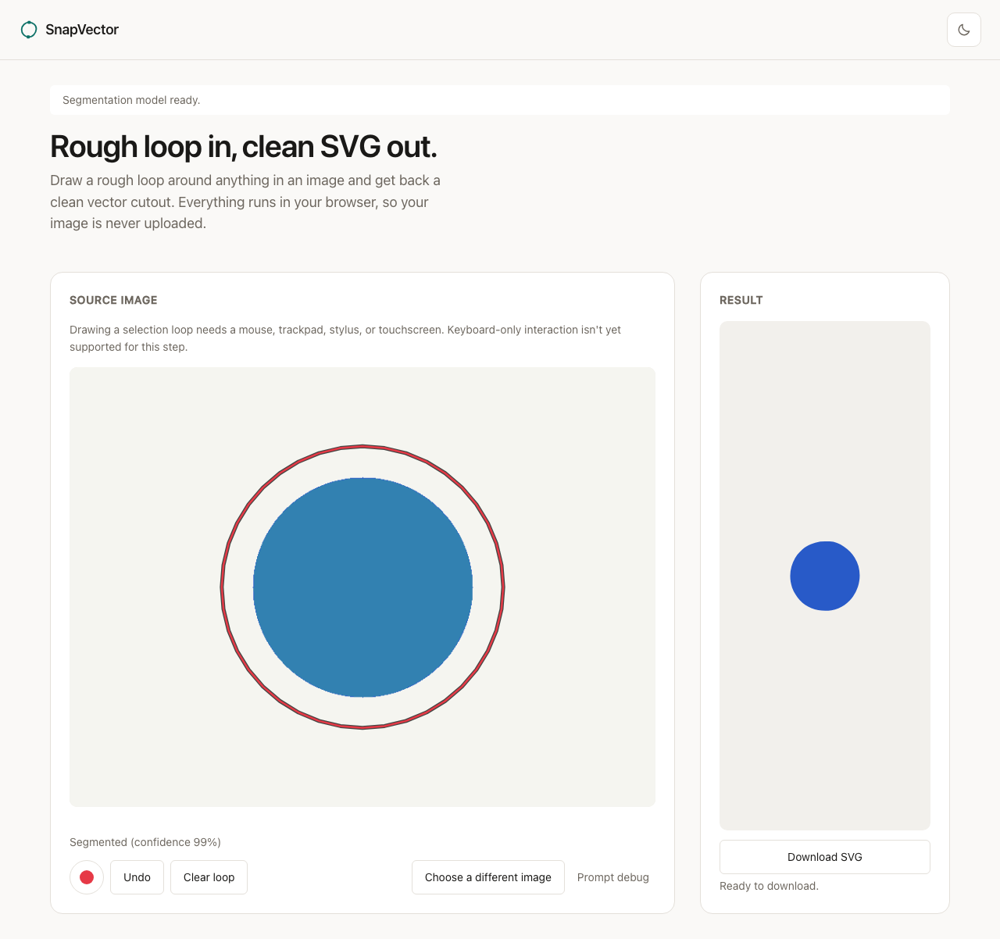

# SnapVector

Draw a rough loop around anything in an image. Get back a clean SVG cutout.

**[snapvector.vercel.app](https://snapvector.vercel.app)**

Everything runs in your browser. The image you upload is never sent anywhere: there is
no backend, no upload endpoint, and nothing to intercept it even if you wanted to. A
[MobileSAM](https://github.com/ChaoningZhang/MobileSAM) model runs locally via ONNX
Runtime Web to find the object you meant, and a hand-written vectorization pipeline
turns the resulting mask into a real SVG path, not a traced bitmap.



## How it works

1. **Draw a rough loop.** It does not need to be precise. A freehand loop around the
   subject is turned into a bounding box plus a handful of interior/exterior points,
   the prompt format MobileSAM's decoder expects.
2. **Segment, locally.** The encoder (run once per image) and decoder (run once per
   loop) are both ONNX models executing in-browser via WebAssembly. No network call is
   made once the ~44 MB of model weights are cached.
3. **Vectorize.** The resulting binary mask is cleaned up (hole-filling, morphological
   smoothing), traced into polygon contours with marching squares, simplified with
   Douglas-Peucker, and fit to cubic Bezier curves, Schneider's least-squares method
   with recursive error-driven subdivision. Holes (a donut, a mug's handle) survive as
   real holes via `fill-rule="evenodd"`, not as a filled-in blob.
4. **Export.** A fill color is sampled from the actual source pixels inside the mask,
   assembled into a hardened, sanitized SVG document, and offered as a download.

Every stage above (2 through 4) is a pure, independently unit-tested module with no DOM
and no model dependency, `src/lib/**`, currently at 97%+ statement coverage. The
architecture and the reasoning behind each major choice (why MobileSAM over full SAM,
why hand-written vectorization instead of a WASM tracer, why the model is fetched from
a CDN instead of vendored) are recorded as ADRs:

- [ADR-0001: Client-side-first architecture](docs/adr/0001-client-side-first-architecture.md)
- [ADR-0002: Vanilla TypeScript and Vite](docs/adr/0002-vanilla-typescript-and-vite.md)
- [ADR-0003: MobileSAM over SAM ViT-H](docs/adr/0003-mobilesam-over-sam-vit-h.md)
- [ADR-0004: Model delivery and caching](docs/adr/0004-model-delivery-and-caching.md)
- [ADR-0005: Hand-written vectorization](docs/adr/0005-hand-written-vectorization.md)
- [ADR-0006: Performance checkpoint](docs/adr/0006-performance-checkpoint.md)

The full spec, technical plan, and per-phase build logs are in [SPEC.md](SPEC.md),
[tasks/plan.md](tasks/plan.md), and [docs/](docs/).

## Local setup

Requires Node 24+ and npm.

```bash
npm install
npm run dev       # http://localhost:5173, hot reload
```

Other commands:

```bash
npm run build      # production build to dist/
npm run preview    # serve the production build locally
npm run check      # typecheck + lint + unit tests (the CI gate)
npm run a11y       # axe + responsive-overflow scan across both themes, three widths
```

The first time the app loads, it downloads the MobileSAM encoder and decoder (~44 MB
combined) from Hugging Face's CDN and caches them via the Cache API. Every visit after
that loads from cache with no network request for the model.

## Stack

Vanilla TypeScript (strict mode) and Vite. No UI framework, no CSS framework, no
runtime dependency beyond `onnxruntime-web`. Vitest for unit tests, Playwright for
real-browser verification, ESLint and Prettier for the rest. Deployed as a static site
on Vercel with $0 recurring cost. See ADR-0002 for why.

## License

MIT
